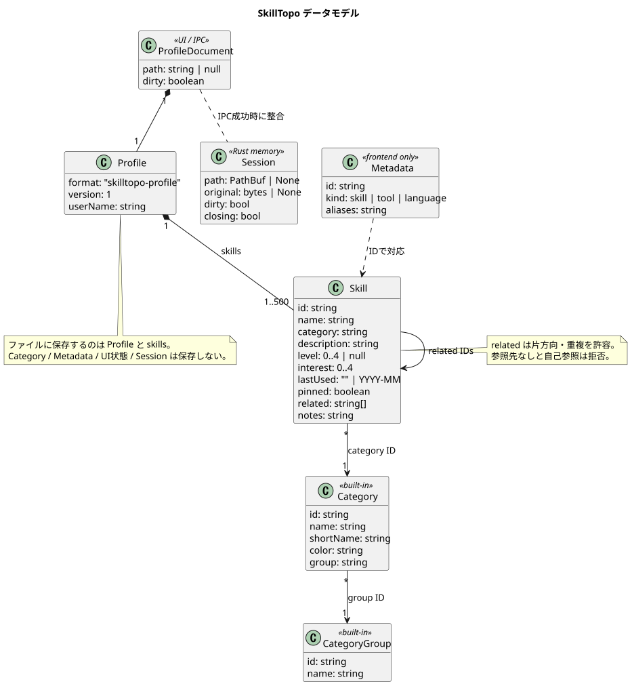

# データ・ファイル仕様

[引継ぎ資料の入口](README.md) ／ [PlantUML: データモデル](diagrams/data-model.puml)



## 1. プロフィール

| フィールド | 型・制約 |
| --- | --- |
| format | 文字列 `skilltopo-profile` 固定 |
| version | 整数1。未対応値は拒否 |
| userName | trim 後に空でなく、元の文字列が80 Unicode コードポイント以内 |
| skills | Skill 配列。補完後も1〜500件 |

型定義は TypeScript の `profile/types.ts` と Rust の `profile/format.rs` にあります。保存対象はこの Profile だけです。`ProfileDocument` は `{profile, path: string|null, dirty: boolean}` で、path と dirty はファイル本文に保存しません。選択中スキル・表示画面・フィルタ・グラフ拡大率も保存しません。

## 2. Skill

TypeScript の定義は `model.ts`、Rust の定義は `catalog.rs` にあります。Rust では Serde の camelCase 変換を使います。

| フィールド | 型 | 検証・用途 |
| --- | --- | --- |
| id | string | 空不可、一意。永続参照キー。長さ上限や文字種の個別制限なし |
| name | string | trim 後に空不可、40コードポイント以内 |
| category | string | categories.json に存在する ID |
| description | string | UTF-8 12,000バイト以内 |
| level | number/null | 整数0〜4、または null |
| interest | number | 整数0〜4 |
| lastUsed | string | 空、または `YYYY-MM`。月は01〜12。未来日や年0000の個別拒否なし |
| pinned | boolean | ピン留め |
| related | string[] | 補完後の skills に存在するID。自己参照不可。重複・片方向指定は許容 |
| notes | string | UTF-8 24,000バイト以内。UI は maxLength=6000 |

ブラウザ UI の maxLength は UTF-16 単位、検証の名前上限はコードポイント単位、説明・メモ上限は UTF-8 バイト単位です。絵文字等を含む境界値では単位の差に注意してください。

ファイルに標準カタログ外の ID があっても、カテゴリや参照などを満たせば読み込めます。ただし、カスタムカテゴリ定義や種類・検索別名をファイルで追加する仕組みはありません。

### JSON の最小例

以下は1項目だけを保存した有効な例です。読み込むと不足する標準項目が追加されます。

```json
{
  "format": "skilltopo-profile",
  "version": 1,
  "userName": "山田",
  "skills": [{
    "id": "python",
    "name": "Python",
    "category": "software",
    "description": "業務の自動化に使用",
    "level": 2,
    "interest": 3,
    "lastUsed": "2026-09",
    "pinned": true,
    "related": [],
    "notes": "集計スクリプトを作成"
  }]
}
```

## 3. 標準カタログとメタデータ

| ファイル／定義 | 内容 |
| --- | --- |
| catalog.json | 既存29件の Skill オブジェクト。一部にデモ評価あり |
| profile-items.json | 追加157件の7要素配列 |
| categories.json | 20カテゴリ。`id, name, shortName, color, group` |
| model.ts / categoryGroups | グループIDと表示名の5定義 |

profile-items の各行は `[id, name, category, kind, aliases, description, related]` です。aliases と related は `|` 区切りの文字列です。kind は skill/tool/language。React の `model.ts` と Rust の `catalog.rs` がそれぞれ合成するので、配列構造を変更する場合は両方の変換を更新します。

React は `kind` と `aliases` を ID に対応する補助メタデータとして保持します。標準29件の一部の種類は `kindOf()` の手書きマッピングで補います。Rust はこの2列を保存データに含めません。unknown ID の種類は既定で skill になります。

related が0件の追加項目を単純に空文字列で表すと、現在の `split('|')` では `['']` となり参照検証に失敗します。空関連を増やす場合は両言語の合成処理も対応させてください。

### 新規作成と不足項目の補完

新規作成の `blankProfile()`／`blank()` は標準データの評価等を全て初期化します。catalog.json のデモ評価は新規プロフィールには引き継ぎません。

読込時は保存されているIDの集合を作り、標準のうち存在しないIDだけを末尾に追加します。追加項目は未評価・興味度0・ピンなし・メモなし・最終使用なしです。既存IDの名前・説明・関連・評価等はファイル側を維持します。

補完後に related の参照も検証します。読込による補完だけでは dirty=true にしません。明示保存するまで元ファイルは変わりません。標準カタログの説明や関連を変更しても、すでにそのIDを持つプロフィールの内容は自動更新されません。

## 4. 保存形式

| 項目 | JSON | バイナリ |
| --- | --- | --- |
| 拡張子 | .json | .skilltopo |
| 内容 | UTF-8 JSON、保存時2スペース整形 | 8バイトヘッダ＋単一 gzip ストリーム |
| gzip 内部 | 該当なし | 空白整形なし UTF-8 JSON |
| JSON BOM | 読込時許容 | 展開された JSON でも許容 |
| 圧縮／暗号 | なし | 圧縮あり、暗号化なし |

バイナリの先頭7バイトは `53 4B 54 4F 50 4F 00`（SKTOPO + NUL）、8バイト目は形式バージョン `01` です。その後ろが gzip です。Profile.version=1 とバイナリヘッダのバージョン1は別の番号です。

読み込みは内容から判定し、識別子があればバイナリ、それ以外は JSON として解釈します。ピッカーは `.skilltopo` と `.json` を対象にします。拡張子と実体が異なるファイルも内容が有効なら読込可能ですが、次の通常保存は拡張子に従った形式になります。

ファイルサイズ・展開後サイズは各8×1024×1024バイト（8 MiB）までです。Rust とブラウザは上限付きで展開し、gzip の破損・途中切断・未対応バージョンを拒否します。Rust は gzip の後ろに余分なバイトが残る場合も明示的に拒否します。

保存方式は、Rust が flate2、ブラウザが標準 CompressionStream です。圧縮結果のバイト列一致は仕様ではありません。互換性は展開後のプロフィールの一致で判断します。

## 5. 保存先とファイル保全

標準の新規保存形式は binary です。デスクトップの初回保存と「名前を付けて保存」では、画面で選んだ形式に対応する拡張子・ファイル名のダイアログを出します。拡張子なしは補完し、選択形式と違う拡張子はエラーです。比較は大文字小文字を区別しません。

通常保存は現在のパスを使い、拡張子で出力形式を決めます。この場合は上部の形式選択を変更しても変換しません。

`profile/storage.rs` の `write_profile()` は次の順序です。

1. プロフィール検証。
2. 現在のパスへ保存するときは、ディスクの全バイトを Session.original と比較。
3. 拡張子確認、エンコード、サイズ確認。
4. 保存先と同じディレクトリに一意な `.skilltopo-<pid>-<nanos>.tmp` を create_new で作成。
5. write_all、sync_all、ファイルハンドルを閉じる。
6. rename で保存先へ反映。失敗時は一時ファイルの削除を試みる。
7. 成功バイトを original に保持し、dirty=false にする。

これはロックによる排他制御ではありません。比較後から置換までの他プロセスの変更を完全には防げません。別名保存の既存ファイルは保存ダイアログの扱いに依存し、現在のパス以外に original 比較は行いません。バックアップ世代管理もありません。

## 6. 旧版移行・互換性

旧版の `catalog.json` は Profile ラッパーのない Skill 配列です。設定から `open_profile(legacy=true)` を呼び、Tauri の app_data_dir にある catalog.json を読んでユーザー名「自分（旧データ）」の新規プロフィールにします。path=null、dirty=true のため、新たな保存先を選びます。

旧経路の `read_catalog()` は通常プロフィールの `decode()` とは別実装です。標準項目の補完元は `seed_catalog()`、ファイル読込は `read_to_string()` で、通常経路の8 MiB制限は適用されません。旧データも含めて制約を統一する場合はこの差を修正してください。

Rust の Profile / Skill は `deny_unknown_fields` を使い、未知のフィールドを拒否します。ブラウザの `parseProfile()` は未知フィールドを明示拒否しません。現時点で両者の検証は完全同一ではありません。ファイル項目の追加時は、両実装と互換移行を同時に変更してください。

旧 exe は `.skilltopo` 非対応です。バイナリを渡す相手には新 exe も渡します。将来の version を黙って読み替える処理はなく、現在は拒否します。
