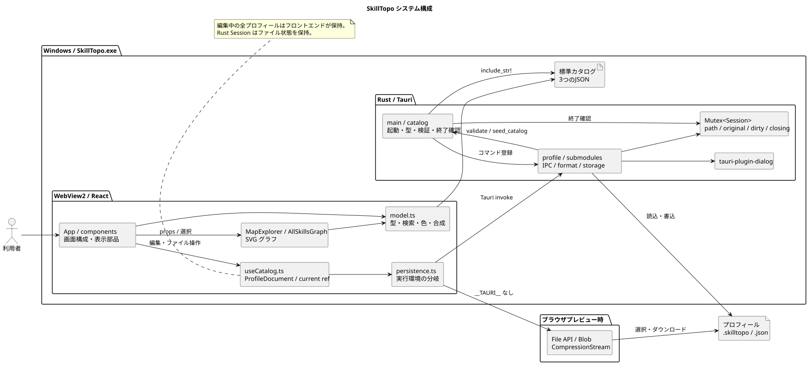
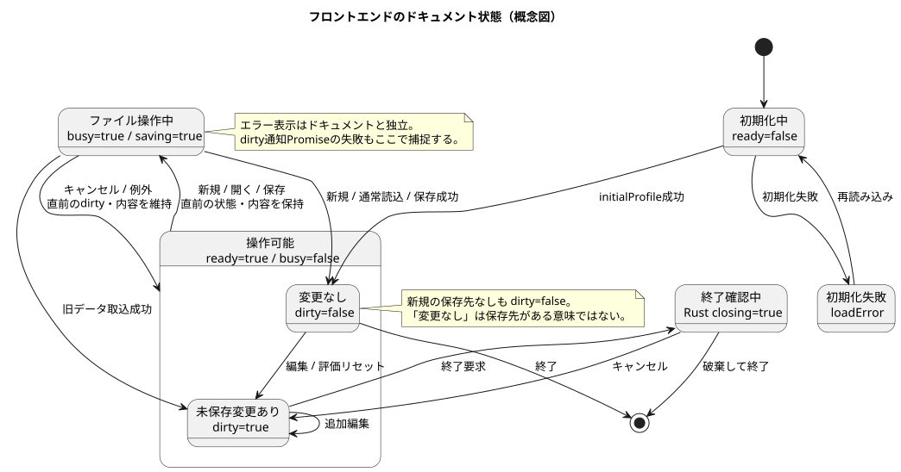
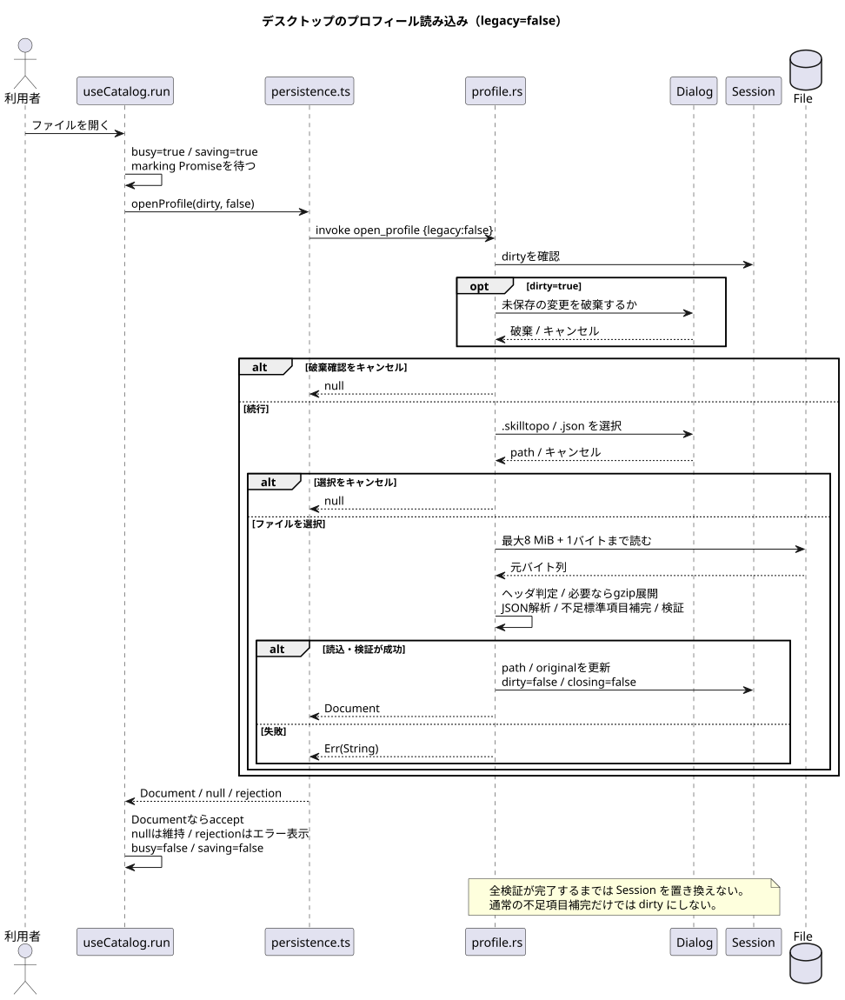
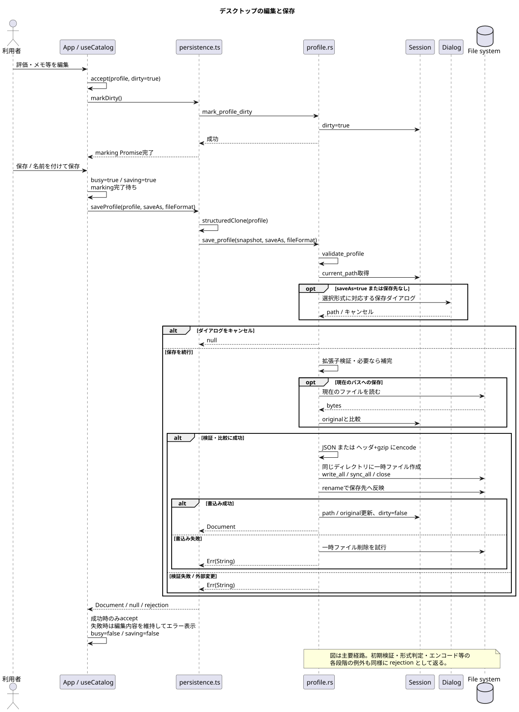

# 設計・機能仕様

[引継ぎ資料の入口](README.md)

## 1. アーキテクチャ

[PlantUML: システム構成](diagrams/architecture.puml)

React の表示データの中心は `useCatalog` が保持する `ProfileDocument` です。`App` はそこからスキル一覧等を取り出し、表示コンポーネントへ渡します。子コンポーネントは選択・編集イベントを親へ返し、直接ファイルを操作しません。各部品は `components/` に分割し、マップと全体グラフは専用コンポーネントを維持しています。

`persistence.ts` は `window.__TAURI__` の有無で実行環境を判定します。デスクトップでは `window.__TAURI__.core.invoke` で Rust コマンドを呼びます。ブラウザプレビューでは File API、Blob、CompressionStream / DecompressionStream を使用します。デスクトップのエラー時にブラウザ保存へ切り替えることはありません。形式変換は `profile/codec.ts`、初期値・検証・補完は `profile/validation.ts`、型と上限は `profile/types.ts` に分かれています。`persistence.ts` の既存exportは呼び出し元との互換のため残しています。

Rust は `Mutex<Session>` を Tauri の managed state に保持します。Session はパス・元バイト列・dirty・終了確認中フラグを管理しますが、編集途中の全プロフィールは保持しません。保存時にフロントエンドからスナップショットを受け取ります。`profile.rs` はコマンド・ダイアログ・Sessionを調停し、`profile/format.rs` に型と変換、`profile/storage.rs` にファイルI/Oを委譲します。Skillと標準データ・旧データ読込は `catalog.rs` にあります。構成図の main / catalog、profile / submodules はこのファイル群をまとめた表示です。

### 実行環境の差

| 項目 | デスクトップ | ブラウザプレビュー |
| --- | --- | --- |
| 読み込み | ネイティブ選択ダイアログ、Rust 検証 | file input、TypeScript 検証 |
| 保存 | 指定ファイルへ書き込み | 選択した形式を毎回ダウンロード |
| 通常保存の形式 | 現在の保存先拡張子を維持 | 画面の保存形式選択を使用 |
| パス | 実際のファイルパス | ファイル名／ダウンロード表示 |
| 外部更新検出 | 読み込み／前回保存時のバイト列と比較 | なし |
| 未保存の確認 | ネイティブダイアログ、終了イベント | confirm、beforeunload |
| 旧版移行 | 設定から旧 catalog.json を読み込む | UI に旧版移行ボタンなし |

`model.ts` の `loadSkills()` と localStorage キーは旧実装互換のコードとして残っています。現在の `useCatalog` の起動・保存経路には使われません。

## 2. 起動・画面構成

起動時は `initialProfile()` により、ユーザー名「未設定」、全スキル未評価、保存先なし、dirty=false のプロフィールを作ります。前回ファイルの自動再読込はありません。読込準備中は専用画面を表示し、失敗すると再読み込みボタンを表示します。

初期画面は `map`、初期選択 ID は `freertos` です。該当 ID がなければ一覧先頭にフォールバックします。画面切替にルーターは使わず、`App` の `view` 状態で分岐します。

| View | 表示名 | 主な機能 |
| --- | --- | --- |
| dashboard | ダッシュボード | 評価率・カバー率・平均習熟度、カテゴリ別評価数、ピン留め |
| map | スキルマップ | グループ／カテゴリ選択、放射状 SVG、習熟度による色 |
| graph | 全体グラフ | 全スキルと関連線、カテゴリ色、拡大、関連先絞り込み |
| related | 隣接スキル | 選択スキルの outgoing related 一覧と小グラフ |
| catalog | カタログ編集 | 検索・カテゴリ・種類で絞り込み、選択して評価等を編集 |
| settings | 設定 | 保存の説明、旧版データ移行、評価リセット |

共通部分は検索バー、プロフィールファイル操作、指標、右側の詳細パネルです。詳細パネルで編集できるのは習熟度、興味度、ピン留め、最終使用月、メモです。ユーザー名は上部で編集します。「カタログ編集」という名前ですが、スキルの追加・削除・改名・説明文・related の編集 UI はありません。

### 評価・集計

| 項目 | 定義 |
| --- | --- |
| 習熟度 | null（未評価）、整数0〜4。null と0は別 |
| 興味度 | 整数0〜4。未評価を表す null はない |
| 評価率 | level が null でない件数 ÷ 全件数 ×100、小数なしに丸める |
| カバー率 | level が2以上の件数 ÷ 全件数 ×100、小数なしに丸める |
| 平均習熟度 | 評価済みだけの平均、小数1桁。0件は「—」 |
| カテゴリ進捗 | カテゴリ内の評価済み件数／全件数 |
| 評価リセット | level=null、interest=0、pinned=false。名前・メモ・最終使用月は維持 |

レベル色は `model.ts` の `colors` 順で0=赤、1=黄、2=緑、3=青、4=紫、未評価=灰色です。レベルの業務上の定義文（例: 指導可能など）は実装されていません。

### 検索

`matchesQuery()` はスキル名、カテゴリ名、標準カタログの検索別名を対象に NFKC 正規化、小文字化し、空白区切りの全語を AND 部分一致で検索します。説明文とメモは検索対象外です。種類は `skill / tool / language` です。

検索結果クリックは選択を更新し、検索を消してマップへ移動します。Enter は先頭一致を選択して検索を消しますが、表示 View は変更しません。マップと全体グラフは検索非一致項目を半透明にします。カタログは非一致項目を非表示にします。

## 3. グラフの仕様

### 分野別マップ: MapExplorer

`viewBox=0 0 720 720`、中心 `(360,360)`。`graph/geometry.ts` の `point()` と `sector()` で円弧を生成します。5グループを切り替え、グループ全体ではカテゴリごとに最大4項目と残数へのリンクを表示します。カテゴリ選択後は16項目単位のページ表示です。

検索条件と習熟度フィルタは半透明表示に使います。選択が変わるとカテゴリのグループ・ページへ追従します。色は習熟度で、全体グラフのカテゴリ色とは意味が異なります。

### 全体グラフ: AllSkillsGraph

`graph/relations.ts` の `relationEdges()` は関連IDのペアを文字列順に揃え、双方向・重複した指定を1本の無向エッジにまとめます。存在しないIDと自己参照はここでも除外します。カテゴリをまたぐ関連も描画します。

配置は物理シミュレーションではなく固定計算です。

| 定数 | 値・意味 |
| --- | --- |
| viewBox | `0 0 1760 2150` |
| カテゴリ配置 | 4列、標準20カテゴリで5行 |
| 中心座標 | x=`210 + (index % 4) * 440`、y=`200 + floor(index / 4) * 430` |
| 項目配置 | カテゴリ内を半径150の円周上に等間隔 |
| カテゴリ背景 | 半径185 |
| 拡大 | 100〜400%、25%刻み。SVG の CSS 幅を変更 |
| スクロール領域 | 縦横スクロール、最大高さ70vh |

全ノードを SVG に描画し、選択スキルに直接接続する線を強調します。「選択スキルと関連先のみ」は入方向・出方向を含む1ホップの集合を残します。その集合内の他の線も表示対象です。推移的につながる全スキルを抽出する機能ではありません。

「全体表示」ボタンは拡大率だけを100%に戻します。絞り込み解除やスクロール位置リセットはしません。長いノード名は省略されますが、title と詳細で確認できます。ドラッグによる移動や位置保存、画像書き出しはありません。

### 隣接グラフ: components/RelatedGraph

選択スキル自身の `related` の順序を使い、存在する項目を最大4件表示します。配置は固定4箇所です。隣接スキル画面の一覧と右側のチップは outgoing related を全件表示します。

したがって A→B だけが登録された場合、全体グラフで B を選ぶと A と接続しますが、B の隣接スキル一覧には A が出ないことがあります。現在の意図した実装差として、改修時にどちらの定義へ揃えるか決めてください。関連は学習の前提条件や順序を意味しません。

## 4. 状態管理

[PlantUML: 状態遷移](diagrams/document-state.puml)

| 変数 | 所在 | 用途 |
| --- | --- | --- |
| doc | useCatalog | レンダリング用 ProfileDocument |
| current ref | useCatalog | 非同期操作から参照する最新ドキュメント |
| ready | useCatalog | 初期化完了 |
| busy ref / saving | useCatalog | 操作の二重起動防止／画面制御。読込・新規時も saving=true |
| marking ref | useCatalog | Rust への dirty 通知 Promise。ファイル操作前に待つ |
| loadError | useCatalog | 初期化失敗 |
| saveError | useCatalog | 新規・読込・保存・dirty 通知のエラーもここへ入る |
| selectedId / view / query 等 | App | 表示・選択・検索。プロフィールには保存しない |
| path / original / dirty / closing | Rust Session | 現ファイル、競合検出用バイト列、破棄確認状態 |

編集は新しい profile を作り `accept()` で state と ref を一緒に更新し、dirty=true にします。その後 `markDirty()` で Rust に通知します。保存開始時に `structuredClone()` でスナップショットを取ります。

`run()` は busy なら終了し、dirty 通知の完了を待ってファイル操作を呼びます。非 null の戻り値だけを採用します。キャンセルは null のため現在のデータを維持します。エラーは表示用状態に変換し、finally で busy/saving を解除します。

処理中はプロフィール入力とファイルボタンを disabled にし、メイン／詳細領域に inert を設定します。dirty 通知が失敗した場合、その rejected Promise を次の操作でも待つため、再編集等で置き換わるまで操作が失敗し続ける可能性があります。

## 5. IPC 契約

[PlantUML: 読み込み](diagrams/open-profile.puml) ／ [編集と保存](diagrams/save-profile.puml)

登録場所は `main.rs` の `tauri::generate_handler!`。フロントエンドの引数は camelCase、Rust の関数引数は snake_case です。

| コマンド | JS 引数 | 成功結果 | 備考 |
| --- | --- | --- | --- |
| initial_profile | なし | Document | 空プロフィール。直近ファイルは開かない |
| mark_profile_dirty | なし | void | Session.dirty=true |
| new_profile | なし | Document または null | 未保存破棄確認後に Session を初期化 |
| open_profile | `{legacy: boolean}` | Document または null | 通常はファイル選択、legacy は旧固定パス |
| save_profile | `{profile, saveAs, fileFormat}` | Document または null | fileFormat は binary/json。省略時 binary |

Rust の `Result::Err(String)` は invoke の rejection です。新規・読込・保存のブロッキングダイアログとファイル処理は `spawn_blocking` 内で行います。

読み込みは全検証後に Session を更新します。保存も書き込み成功後に Session を更新します。どちらもエラー時は以前の Session と UI ドキュメントを維持します。

終了時、dirty=false は標準終了します。dirty=true は `CloseRequested` を prevent し、破棄確認を表示します。`closing` で確認の多重起動を抑止し、破棄で destroy、キャンセルで closing=false に戻します。保存をして終了する専用ボタンはありません。

## 6. ホスト設定

`tauri.conf.json` は識別子 `com.skilltopo.desktop`、初期1600×960、最小1000×700、標準ウィンドウ枠あり、`withGlobalTauri=true` です。`frontendDist` は `../frontend/dist`。インストーラー作成は `bundle.active=false` です。

CSP は自己オリジンを中心とし、IPC 接続、data 画像、inline style を許可します。外部 CDN は使用しません。ネイティブダイアログはフロントエンドからプラグインを直接呼ぶ構成ではなく、Rust のコマンドから開きます。
