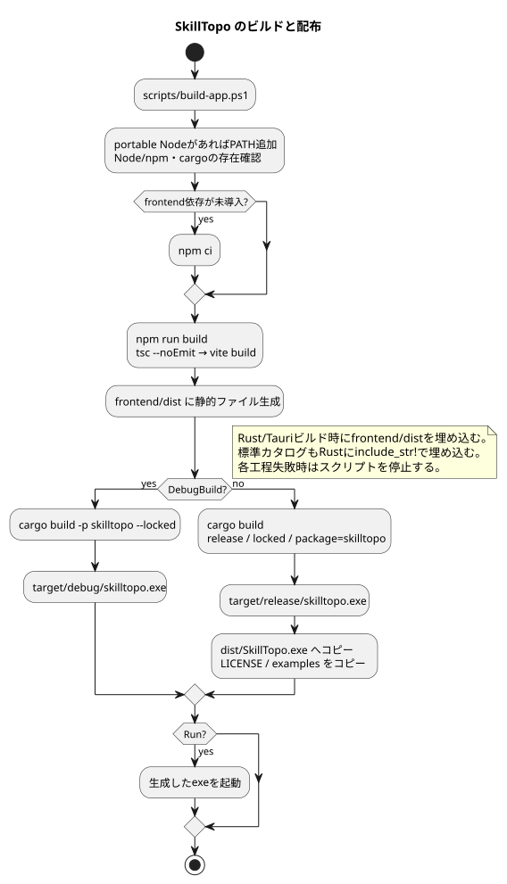

# 修正・ビルド・検証ガイド

[引継ぎ資料の入口](README.md)

## 1. 開発環境

対象は Windows x64 です。Node.js 22.12以上、npm、Rust の MSVC ツールチェーン、Visual Studio C++ Build Tools と Windows SDK を使います。実行側には WebView2 Runtime が必要です。

この作業環境の Node は `.tools/node-v22.16.0-win-x64` にあります。ビルド／プレビュースクリプトがあれば自動で PATH に追加します。`.tools` は Git 管理外なので、別PCには自動では移りません。VS Code の Rust デバッグ設定は CodeLLDB を前提にしています。

| 定義ファイル | 主な依存・設定 |
| --- | --- |
| frontend/package.json | React19、lucide-react、TypeScript5.8系、Vite7系、esbuild |
| src-tauri/Cargo.toml | Tauri2、serde、serde_json、tauri-plugin-dialog2、flate2 |
| frontend/tsconfig.json | strict、未使用ローカル／引数エラー、ES2022、noEmit |
| Cargo.toml | src-tauri を含む workspace |
| frontend/package-lock.json / Cargo.lock | 再現用の解決済み依存バージョン |

Cargo.toml の rust-version は1.77.2という宣言ですが、全依存がその最小版でビルドできるかは今回確認していません。既存環境か、依存の要求を満たす MSVC ツールチェーンを使用してください。

## 2. 動かす・ビルドする

以下はリポジトリ直下を作業ディレクトリとします。

```powershell
# ブラウザで UI を確認（終了は Ctrl+C）
powershell -ExecutionPolicy Bypass -File scripts/start-frontend.ps1

# Windows デバッグ版のビルドと起動
powershell -ExecutionPolicy Bypass -File scripts/build-app.ps1 -DebugBuild -Run

# 配布用リリース版
powershell -ExecutionPolicy Bypass -File scripts/build-app.ps1
```

ブラウザの URL は Vite が出力するものを使用します。ホストは127.0.0.1です。ネイティブダイアログ、ファイル置換、終了確認はデスクトップ版でも確認してください。

[PlantUML: ビルドと配布](diagrams/build.puml)



ビルドスクリプトは依存が未導入なら npm ci を実行し、`npm run build`（型チェック→Vite）後に `cargo build -p skilltopo --release --locked` を実行します。依存がすでにあると npm ci は省略されるため、package-lock.json を更新した場合は明示的に npm ci を実行してください。

デバッグでは `target/debug/skilltopo.exe`、リリースでは `target/release/skilltopo.exe` を生成します。リリース時のみ `dist/SkillTopo.exe`、LICENSE、examples を配置します。フロントエンドの生成物は `frontend/dist/` です。

`cargo run` 単独ではフロントエンドのソースをビルドしません。React/CSS/データを変更して exe で確認する際は必ずフロントエンドも再ビルドしてください。F5 の preLaunchTask はこのビルドを行います。

## 3. 変更対象の早見表

| 変更したいこと | 主なファイル・関数 | 合わせて確認 |
| --- | --- | --- |
| 文言・ナビ・画面追加 | components/Sidebar.tsx: View・navigation、各components、App.tsx: view分岐 | styles.css、検索後の画面遷移 |
| 評価・詳細項目 | components/Rating.tsx、SkillDetails.tsx、App.tsx: update | Skill 型、検証、初期値、リセット、保存 |
| 指標の計算 | components/Metrics.tsx: assessed・metrics、Dashboard.tsx: 進捗 | null と0の区別、分母、未評価のみのケース |
| マップの表示件数 | MapExplorer.tsx: overviewLimit、pageSize | selected の追従とページ境界 |
| 円弧の形・色 | graph/geometry.ts: point・sector、model.ts: colors | MapExplorer、凡例 |
| 全体グラフ配置 | AllSkillsGraph.tsx: clusters、positions、viewBox | カテゴリ数増加、文字の重なり |
| 関連線の定義 | graph/relations.ts: relationEdges | components/RelatedGraph・RelatedSkills・SkillDetails の出方向の関連との差 |
| 検索対象・別名 | model.ts: matchesQuery、profile-items.json | 絞り込み、NFKC、日本語・全角英数 |
| 保存操作・状態 | useCatalog.ts: edit、run、accept | dirty、Promise失敗、二重起動、キャンセル |
| IPC 追加・引数変更 | persistence.ts、profile.rs、main.rs handler | camelCase 引数、モックテスト |
| バイナリ形式 | profile/codec.ts: encode/decodeProfileBytes、Rust profile/format.rs: encode/unpack/decode | 両言語互換、ヘッダ、バージョン、サイズ制限 |
| 検証・補完 | TS profile/validation.ts、Rust profile/format.rs・catalog.rs | 両環境で同じプロフィールを読めるか |
| ファイル保存・競合検出 | Rust profile/storage.rs | 元ファイル保護、通常保存と別名保存の差 |
| 終了確認 | main.rs: on_window_event | dirty通知、closing、確認キャンセル |
| ウィンドウ・CSP | tauri.conf.json、capabilities/default.json | デスクトップで実確認 |
| 配布ファイル | scripts/build-app.ps1 | dist の生成内容、README |

## 4. 典型的な修正手順

### スキルを追加する

1. `profile-items.json` に7要素の行を追加する。既存と重複しない、長期維持するIDを決める。
2. category は既存のカテゴリID、kind は skill/tool/language、related は存在するIDにする。
3. 必要なら相手側の related にも追加する。片方向指定でも保存可能だが、隣接表示は対称にならない。
4. `frontend/scripts/smoke.mjs` と Rust テストの186等の件数期待値を、新しい仕様に合わせて更新する。関連する資料も更新する。
5. 新規プロフィールと既存プロフィールの読込で追加項目が未評価になり、既存値が維持されることを確認する。
6. exe を再ビルドする。

既存IDを改名すると、旧IDと新IDが別スキルとして残る可能性があります。表示名だけ変える場合も、既存プロフィールの同じIDの name は自動更新されません。既存ファイルまで更新する要件なら明示的な移行処理を設計してください。

### カテゴリを追加・削除する

categories.json を変更し、必要なら `model.ts` の categoryGroups も変更します。標準カタログのカテゴリ参照、検証テスト、MapExplorer と全体グラフの表示範囲も更新します。

全体グラフの viewBox は20カテゴリ相当の固定値です。21カテゴリ以上では下側が切れる可能性があります。カテゴリ削除は旧ファイルの参照を無効化するため、読み替え等の互換対応が必要です。

### プロフィール項目を追加する

1. TypeScript の Profile/Skill と Rust の Profile/Skill を変更する。
2. 初期値、入力UI、useCatalog 更新、リセット時の扱いを決める。
3. TypeScript と Rust の両方の検証を変更する。
4. 旧ファイルに項目がない場合のデフォルトまたはバージョン移行を実装する。Rust の必須フィールド追加だけでは旧ファイルを読めなくなる。
5. ブラウザ→デスクトップ、デスクトップ→ブラウザ、JSON↔バイナリで保持を確認する。
6. examples と形式資料、テストを更新する。JSON 例だけ変更して対応する .skilltopo を放置しない。

通常の本文項目変更で gzip の仕組みまで変える必要はありません。Profile.version とバイナリヘッダのバージョンは独立です。

### 非同期の保存処理を変更する

`accept()` による state/ref 同時更新、保存前のスナップショット、busy による排他、null キャンセル時の維持、例外時の dirty 維持を壊さないようにします。Session.original はエンコード済みの実際の保存バイトで更新します。正規化したJSON同士の比較へ変えると、現在の外部変更検出仕様が変わります。

## 5. 自動検証

```powershell
# 必要な場合だけ、この環境の portable Node を PATH に追加
$env:PATH = (Join-Path $PWD '.tools/node-v22.16.0-win-x64') + ';' + $env:PATH

Push-Location frontend
npm.cmd run format:check
npm.cmd test
npm.cmd run build
Pop-Location
cargo fmt --all -- --check
cargo test -p skilltopo --locked
git diff --check
```

各コマンドの終了コードを確認してください。上の手動例は途中失敗を自動で止める一括スクリプトではありません。依存を変更しない場合は lock を維持します。依存を変更した場合は意図して lock を更新して差分を確認します。

| 自動検証 | 現在の範囲 |
| --- | --- |
| frontend smoke | ID・カテゴリ・関連整合性、検索別名、旧localStorage互換、SSR、全体グラフ全ノード／エッジ |
| frontend persistence | 空プロフィール、疎なJSON補完、値検証、JSON/バイナリ往復、gzip互換、破損・上限・未対応バージョン |
| frontend IPCモック | スナップショット、引数、キャンセル、エラーの伝播 |
| Rust 8テスト | カタログ、検証、移行、ファイル置換、競合、プロフィール補完、バイナリ往復・破損・上限 |
| 整形チェック | Prettier: TS/TSX/CSS/テスト、rustfmt: Rust |
| frontend build | TypeScript の型チェックと本番バンドル |

smoke は esbuild でモジュールを Node 用に変換し、assert と React の renderToString を使います。実ブラウザのクリックやレイアウト、ネイティブダイアログを自動操作する E2E テストではありません。

今回の資料作成時の検証結果は後述の「確認記録」に記載します。機能追加時は変更に対応する検証を追加してください。

### 配布前の手動確認

| 操作 | 確認する結果 |
| --- | --- |
| 新規起動 | 全項目未評価、保存先なし、初期マップ |
| ユーザー名・メモ・レベル変更 | 詳細・集計へ反映、未保存表示 |
| binary で初回保存→再度開く | 日本語・絵文字・評価・ピン・月・関連が保持 |
| JSON で別名保存→再度開く | 同一プロフィール、元のバイナリは保持 |
| 開いたJSONで形式選択をbinaryへ変え通常保存 | 保存先JSON形式を維持 |
| 編集後に新規／開く／終了をキャンセル | 現在の編集内容を維持 |
| 外部で同じファイルを編集して通常保存 | 競合エラー、別名保存が可能 |
| 2プロセスで別ファイルを開く | 各ユーザーの内容を独立して表示 |
| 全体グラフで選択・拡大・絞り込み | 詳細連動、関連線、スクロール |
| 1000×700 と通常画面サイズ | 操作ボタン、長い名前、ラベルの可読性 |

## 6. 配布

`dist/SkillTopo.exe`、LICENSE、必要なプロフィールファイルを渡します。examples はサンプルです。受領側で Node/Rust/開発サーバーは不要ですが WebView2 は必要です。

ユーザーファイルは exe に埋め込まず、アプリの「ファイルを開く」で読みます。拡張子のOS関連付け、ファイル引数からの起動、インストーラー、自動更新、コード署名のビルド工程はありません。

`dist/`、`target/`、`.tools/` は Git 管理外です。ソース引継ぎでは `AllSkillsGraph.tsx`、docs、examples の `.skilltopo` のような新規ファイルの追加漏れに注意してください。`git status --short` で確認できます。

## 7. 既知の制約と改善候補

以下は資料作成時点の観察です。今回の分割は既存の挙動を維持する方針です。検証の範囲は [確認記録](verification.md) を参照してください。

| 現状 | 修正時の考慮事項 |
| --- | --- |
| 検証・初期値がTS/Rustに重複 | 項目追加時に両方変更。共通のテスト用データを増やすと差を検出しやすい |
| Rustは未知フィールド拒否、TSは明示拒否なし | 互換方針を決めて統一する余地あり |
| グラフが固定配置、全項目描画 | 大量項目・長名で混雑。自動配置やレイアウト調整は未実装 |
| カテゴリ4列・viewBox固定 | カテゴリ追加時に描画範囲を計算するよう変更が必要 |
| 全体グラフと隣接表示で方向の扱いが異なる | 両方を変更するなら related の意味を先に定義 |
| 標準項目の削除を保存しても次回読込で復活 | 個人による非表示／削除機能には別の状態モデルが必要 |
| UIではカタログ構造を編集できない | 名称・説明・related はソース／JSON経由。追加UIは別実装 |
| original の比較は完全な排他ではない | 同時保存の完全防止には追加設計が必要 |
| ブラウザ保存はダウンロード開始でdirty=false | ディスクへの保存完了やキャンセルを把握していない |
| 旧データ読込に8 MiB制限なし | 通常経路と揃える場合は read_catalog を変更 |
| dirty通知失敗後に次の操作も失敗し得る | 再試行／通知状態の復旧を設計する余地あり |
| UIに v1.0.0 (Phase 1)、パッケージには0.1.0 | リリース番号を揃えるなら components/Sidebar.tsx、package.json、Cargo.toml、tauri.conf.json と各lockを確認 |
| CSSには後半の追記上書きが残る | 全体は整形済み。規則を並べ替えると優先順位が変わるため、変更時は後続の同じセレクタも確認 |
| データは圧縮のみで暗号化・署名なし | バイナリは秘密保持や改ざん防止を提供しない |

## 8. 問題が起きたとき

| 症状 | 最初に確認 |
| --- | --- |
| Reactの修正がexeに出ない | frontend/dist の再生成と exe 再ビルド。古い起動プロセスも確認 |
| 保存ボタンが反応しない／無効 | saving/busy、dirty通知Promise、表示されたエラー |
| 入力値が保存できない | TS/Rust両検証、バイト数、関連ID、カテゴリID |
| 古いJSONが開けない | Profileラッパーの有無、version、必須／未知フィールド。旧Skill配列は移行経路へ |
| バイナリが開けない | ヘッダ、バージョン、gzip破損、8 MiB制限、対応exe |
| 同じファイルに保存できない | 他アプリ更新、削除、権限、保存先使用中。別名保存で切り分け |
| 起動先PCで動かない | x64 Windows、WebView2、実際のエラーメッセージ |

## 9. 確認記録

2026-09-13に現行ソース・設定・テストを読んで資料化しました。自動検証の再実行結果と図の検証範囲は [確認記録](verification.md) にまとめます。
